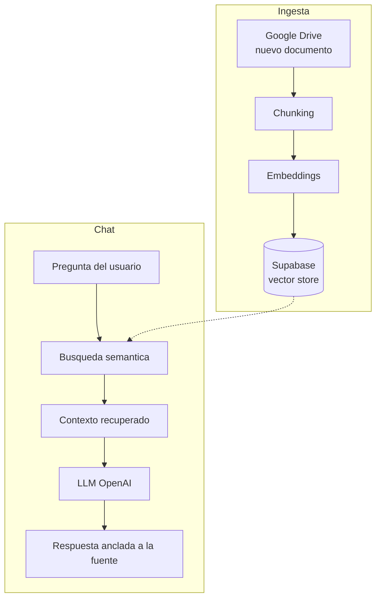

# RAG Virtual Assistant — n8n

Asistente conversacional Retrieval-Augmented Generation (RAG) orquestado en n8n para responder consultas sobre bases documentales regulatorias y estructuradas, reduciendo ~60% el tiempo de búsqueda manual.

## Contexto

Los equipos pierden tiempo buscando información en grandes volúmenes de documentos internos (normativa, reportes, manuales). Un buscador por palabras clave no entiende lenguaje natural ni entrega una respuesta directa anclada a su fuente.

## Objetivo

Construir un asistente que responda en lenguaje natural basándose exclusivamente en los documentos del usuario, combinando recuperación semántica (embeddings) con un LLM, sin necesidad de reentrenar modelos.

## Arquitectura



## Stack

| Categoría | Herramientas |
|---|---|
| Orquestación | n8n (flujos + agentes) |
| LLM / Embeddings | OpenAI |
| Vector store | Supabase (pgvector) |
| Fuente documental | Google Drive |

## Estructura del proyecto

```
rag-virtual-assistant/
├── RAG DATA BASE VILLANUEVA K.json   # Workflow n8n exportado (importar en n8n)
└── README.md
```

## Ejecución

1. En n8n: **Import from File** y carga `RAG DATA BASE VILLANUEVA K.json`.
2. Configura credenciales: OpenAI, Supabase y Google Drive.
3. Activa el flujo de ingesta (indexa documentos) y el flujo de chat (responde consultas).

## Resultados e impacto

- **~60% menos tiempo** de búsqueda manual de información.
- Respuestas en lenguaje natural **ancladas a la fuente**, no genéricas.
- Arquitectura RAG que actualiza su conocimiento **sin reentrenar** modelos: basta con agregar documentos.

## Próximos pasos

- Reranking de los fragmentos recuperados para mayor precisión.
- Citaciones con enlace directo al documento origen.
- Evaluación de fidelidad (faithfulness) y guardrails contra alucinaciones.

## Licencia y contacto

MIT. Álvaro Villanueva Kobayashi — alvarovillakoba515@gmail.com · [GitHub](https://github.com/Alvaro192023)
